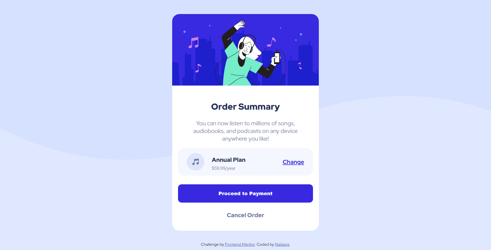

# Frontend Mentor - Profile card component solution

This is a solution to the [Profile card component challenge on Frontend Mentor](https://www.frontendmentor.io/challenges/profile-card-component-cfArpWshJ).

## Table of contents

- [Overview](#overview)
  - [The challenge](#the-challenge)
  - [Screenshot](#screenshot)
  - [Links](#links)
- [My process](#my-process)
  - [Built with](#built-with)
  - [What I learned](#what-i-learned)
- [Author](#author)

## Overview

### The challenge

- Build out the project to the designs provided

### Screenshot

### Links

- Solution URL: [https://github.com/notanut/order-summary](https://github.com/notanut/order-summary)
- Live Site URL: [https://first-frontendmentor.netlify.app/](https://first-frontendmentor.netlify.app/)

## My process

### Built with

- Semantic HTML5 markup
- CSS custom properties
- Flex

### What I learned

This project is my first project in frontendmentor.io. I learned a lot how to build a simple real-world project 

## Author

- Website - [Natasya](https://project-portofolio.netlify.app/)
- Frontend Mentor - [@notanut](https://www.frontendmentor.io/profile/notanut)
